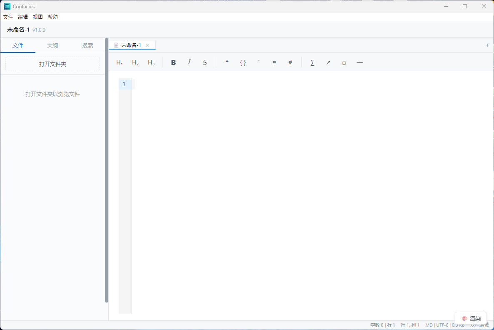

# Confucius

> A local Markdown editor built with Electron + React + CodeMirror 6, with plugin support

[中文文档](./README.md)

## Features

### Three Editing Modes
- **Split View** (split): Source code on the left, instant Markdown rendering on the right (default)
- **WYSIWYG Mode**: Hide syntax markers in the editing area, restore display near cursor
- **Preview Mode**: Full-screen reading with centered layout (`Ctrl+Shift+O`)

### Editor
- **Format Toolbar**: Headings, bold/italic/strikethrough, quote/code block/list, link/image/hr/formula
- **CodeMirror 6 Core**: High-performance text editing with Markdown syntax highlighting
- **Code Highlighting**: Support for 190+ languages (highlight.js)
- **Math Formulas**: KaTeX rendering for `$...$` inline and `$$...$$` block formulas
- **Diagram Support**: Mermaid flowcharts, sequence diagrams, Gantt charts, etc.
- **GFM Compatible**: Task lists, tables, etc.
- **Focus Mode** (F11): Non-active lines semi-transparent
- **Typewriter Mode** (F12): Active line always centered in viewport

### File Management
- **File Tree Sidebar**: Browse and open Markdown files within a folder
- **Outline Panel**: Auto-extract heading structure, click to jump to editor and preview
- **Global Search**: Cross-file full-text search with 300ms debounce, parallel reading
- **File Operations**: New, open, save, save as
- **Context Menu**: New file/directory, rename, delete
- **Drag & Drop Open**: Drag .md/.markdown files to app icon to open directly

### View & Appearance
- **Three Themes**: Light / Dark / Sepia, persisted in localStorage
- **Resizable Split**: Adjust split width freely
- **Scroll Sync**: Editor and preview scroll percentage synced in split mode

### Export
- **HTML Export**: Generate standalone HTML file
- **PDF Export**: Generate A4 document via Electron printToPDF

### Status Bar & Plugins
- **Status Bar**: Display editing mode, file encoding/size, cursor position, word count at bottom
- **Plugin System**: Support for built-in and external plugins
  - Commander mode + sandbox execution
  - Plugins can register status bar entries, sidebar panels, global commands
  - Dependency management (topological sort), event bus, config persistence
  - Plugin management UI (load/unload/enable/disable)

### Security
- **XSS Protection**: DOMPurify whitelist filtering
- **Path Validation**: Reject `..` traversal and null byte injection
- **Encoding Detection**: BOM + jschardet, support UTF-8/GBK/Shift-JIS

## Screenshot



**Split editing mode**: CodeMirror 6 editor on the left, markdown-it live preview on the right, status bar at bottom showing editing info.

## Keyboard Shortcuts

| Shortcut | Action |
|----------|--------|
| `Ctrl+N` | New file |
| `Ctrl+O` | Open file |
| `Ctrl+S` | Save file |
| `Ctrl+Shift+S` | Save as |
| `Ctrl+\` | Toggle sidebar |
| `Ctrl+Shift+F` | Global search |
| `Ctrl+Shift+P` | Toggle editing mode (split ↔ wysiwyg) |
| `Ctrl+Shift+O` | Toggle preview mode |
| `Ctrl+Shift+I` | Plugin manager |
| `F11` | Focus mode |
| `F12` | Typewriter mode |
| `Ctrl+B` | Bold `**text**` |
| `Ctrl+I` | Italic `*text*` |
| `Ctrl+K` | Insert link |
| `` Ctrl+` `` | Inline code |
| `` Ctrl+Shift+` `` | Code block |
| `Ctrl+Shift+M` | Formula block |
| `Ctrl+Shift+L` | Unordered list |
| `Ctrl+Shift+[` | Quote block |
| `Ctrl+Shift+H` | Export HTML |
| `Ctrl+Shift+E` | Export PDF |

## Quick Start

```bash
# Install dependencies
npm install

# Start development mode (Vite HMR + Electron hot reload)
npm run dev

# Type check
npm run typecheck

# Run unit/integration tests (115 tests)
npm test

# Run E2E tests (14 tests, requires build first)
npm run build
npm run test:e2e

# Production build
npm run build

# Package installer
npm run pack:win    # Windows .exe
npm run pack:mac    # macOS .dmg
npm run pack:linux  # Linux .AppImage
```

## Tech Stack

| Layer | Technology |
|-------|------------|
| Desktop Framework | Electron 28 |
| Frontend Framework | React 18 + TypeScript |
| Build Tool | Vite 5 + vite-plugin-electron |
| Editor Core | CodeMirror 6 |
| Markdown Parser | markdown-it + markdown-it-texmath |
| Code Highlighting | highlight.js |
| Math Formulas | KaTeX |
| Diagram Rendering | Mermaid |
| State Management | Zustand |
| XSS Security | DOMPurify |
| DOM Diffing | morphdom |
| Encoding Detection | jschardet + iconv-lite |
| Testing Framework | Vitest + Playwright |

## Project Structure

```
confucius/
├── electron/                       # Main process (Node.js)
│   ├── main.ts                     # Window creation, lifecycle, drag & drop open
│   ├── menu.ts                     # Native menu
│   ├── preload.ts                  # contextBridge secure API
│   ├── ipc-handlers.ts             # IPC channel registration
│   └── services/
│       ├── file-service.ts         # File read/write (path security check)
│       ├── file-watcher.ts         # File change listener
│       ├── export-service.ts       # HTML/PDF export
│       ├── search-service.ts       # Parallel full-text search
│       ├── scanner-service.ts      # Plugin directory scan
│       └── encoding-detector.ts    # Auto encoding detection
│
├── src/                            # Renderer process (React)
│   ├── main.tsx                    # React entry
│   ├── App.tsx                     # Root component (menu action dispatch)
│   │
│   ├── components/
│   │   ├── Editor/                 # Editor components
│   │   ├── Preview/                # Preview components
│   │   ├── Sidebar/                # Sidebar components
│   │   └── Settings/               # Settings components
│   │
│   ├── editor/                     # Editor core
│   │   ├── cm6-setup.ts            # CM6 configuration
│   │   ├── keybindings.ts          # Editor shortcuts
│   │   ├── markdown-renderer.ts    # markdown-it + texmath
│   │   └── ...
│   │
│   ├── engine/                     # Plugin engine
│   │   ├── PluginEngine.ts         # Engine core
│   │   ├── HostAPIBridge.ts        # Host adapter
│   │   └── ...
│   │
│   ├── services/                   # Services
│   ├── stores/                     # Zustand stores
│   ├── styles/                     # CSS styles
│   ├── utils/                      # Utilities
│   └── types/                      # TypeScript types
│
├── test/                           # Tests (131 tests)
│   ├── unit/                       # Unit tests
│   ├── integration/                # Integration tests
│   └── e2e/                        # E2E tests (14 tests)
│
├── .github/workflows/              # CI/CD
│   ├── ci.yml                      # lint + typecheck + unit tests
│   ├── e2e.yml                     # E2E tests
│   └── release.yml                 # Multi-platform packaging
│
├── docs/                           # Documentation
├── themes/                         # Theme CSS variables
├── plugins/                        # Third-party plugins
│
├── package.json
├── vite.config.mts
├── playwright.config.ts
└── electron-builder.yml
```

## Development Status

| Phase | Status | Content |
|-------|--------|---------|
| Phase 1 | ✅ Done | Project skeleton, Electron + Vite + React, IPC communication |
| Phase 2 | ✅ Done | CM6 editor, split preview, file new/open/save |
| Phase 3 | ✅ Done | Code highlighting, formulas, sidebar (file tree/outline/search), shortcuts, tab bar |
| Phase 4 | ✅ Done | HTML/PDF export, theme system, Mermaid, file watcher |
| Phase 5 | ✅ Done | WYSIWYG instant rendering, format toolbar, focus/typewriter mode |
| Phase 6 | ✅ Done | DOMPurify XSS protection, morphdom incremental rendering, large file handling |
| — | | |
| Plugin System v3 | ✅ Done | PluginEngine, HostAPIBridge decoupling, dependency management, event bus, sandbox execution, config persistence, plugin management UI |
| Preview Mode | ✅ Done | Full-screen reading/switch/scroll sync |
| Tech Debt | ✅ Done | CSS Modules migration, dead code cleanup, state simplification, IPC simplification |
| Unit/Integration Tests | ✅ Done | 115 tests / 20 files |
| E2E Tests | ✅ Done | 14 tests (Playwright + Electron) |
| CI/CD | ✅ Done | GitHub Actions (ci.yml / e2e.yml / release.yml) |
| Drag & Drop Open | ✅ Done | Drag .md files to app icon to open directly |

## License

MIT