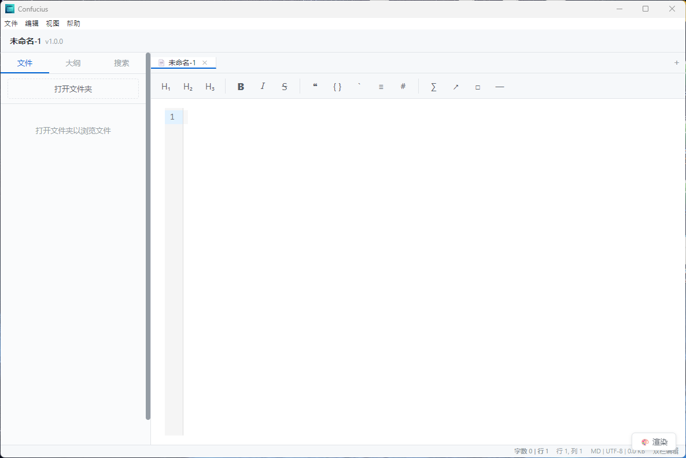

# Confucius

> A local Markdown editor built with Electron + React + CodeMirror 6, with plugin support

[中文文档](./README.md)

## Screenshot



Split editing mode: CodeMirror 6 editor on the left, markdown-it live preview on the right, status bar at bottom.

## Features

### Three Editing Modes
- **Split View** (split): Source code on the left, instant Markdown rendering on the right (default)
- **WYSIWYG Mode**: Hide syntax markers for headings, bold/italic/strikethrough, inline code, unordered lists, and blockquotes; restore display near cursor
- **Preview Mode**: Full-screen reading with centered layout (`Ctrl+Shift+O`)

### Editor
- **Format Toolbar**: Undo/redo, headings, bold/italic/strikethrough, quote/code block/list, link/image/hr/formula, focus/typewriter mode
- **CodeMirror 6 Core**: High-performance text editing with Markdown syntax highlighting
- **Code Highlighting**: 190+ languages via highlight.js
- **Math Formulas**: KaTeX rendering for `$...$` inline and `$$...$$` block formulas
- **Diagram Support**: Mermaid flowcharts, sequence diagrams, Gantt charts, etc.
- **GFM Compatible**: Task lists, tables, etc.
- **Focus Mode** (F11): Non-active lines semi-transparent
- **Typewriter Mode** (F12): Active line always centered in viewport
- **Context Menu**: Right-click for save/save-as/undo/redo/cut/copy/paste

### File Management
- **Welcome Screen**: Rich zero-state panel with cultural brush-stroke decoration, "Open Folder" and "New Note" quick actions
- **Recent Files**: Auto-tracks last 10 opened files, one-click reopen from welcome screen
- **Quick Toolbar**: New, open, toggle sidebar, search, theme toggle, export, edit/preview mode, settings
- **File Tree Sidebar**: Browse and open Markdown files within a folder
- **Outline Panel**: Auto-extract heading structure, click to jump in editor and preview
- **Global Search**: Cross-file full-text search, 300ms debounce, parallel reading
- **File Operations**: New, open, save, save as
- **Sidebar Context Menu**: New file/directory, rename, delete
- **Drag & Drop Open**: Drag `.md` / `.markdown` files to app icon to open directly

### View & Appearance
- **Eight Themes**: Light (Plain White, Warm Sun, Cloud, Mint) / Dark (Night Black, Deep Sea, Warm Gray, Ink Bamboo), persisted in localStorage, toolbar one-click toggle
- **Brand Titlebar**: App name and tagline on the left, toolbar on the right
- **Unified Settings Panel**: General settings (focus/typewriter/hide menu), theme management with swatches, shortcut reference, about
- **Resizable Split**: Drag to adjust split width freely
- **Scroll Sync**: Editor and preview scroll percentage synced in split mode
- **Sidebar Paper Texture**: Subtle CSS-generated grain overlay on warm themes

### Export
- **HTML Export**: Generate standalone HTML file
- **PDF Export**: Generate A4 document via Electron printToPDF

### Status Bar & Plugins
- **Status Bar**: Show editing mode, file encoding/size, cursor position, word count
- **Plugin System**: Built-in and external plugin support
  - Sandbox execution + command bus
  - Plugins can register status bar entries, sidebar panels, global commands
  - Dependency management (topological sort), event bus, config persistence
  - Plugin management UI (load/unload/enable/disable)
  - TypeScript type definitions
- **Built-in Plugins** (auto-activated on startup):
  - **Doc Templates**: Insert predefined templates (README, API docs, blog, weekly report, meeting notes) with variable substitution
  - **Code Runner**: Run JavaScript/Python code blocks in Markdown and view output instantly
- **Example Plugins** (load via Plugin Manager UI, located in `plugins/`):
  - **Doc Stats**: Real-time word count, reading time, full statistics report in status bar
  - **Writing Aid**: Smart suggestions and writing assistance

### Security
- **XSS Protection**: DOMPurify whitelist filtering
- **Path Validation**: Reject `..` traversal and null byte injection
- **Python Execution Confirmation**: Show code preview dialog before running, user must confirm
- **Encoding Detection**: BOM + jschardet, support UTF-8/GBK/Shift-JIS

## Keyboard Shortcuts

| Shortcut | Action |
|----------|--------|
| `Ctrl+N` | New file |
| `Ctrl+O` | Open file |
| `Ctrl+S` | Save file |
| `Ctrl+Shift+S` | Save as |
| `Ctrl+\` | Toggle sidebar |
| `Ctrl+Shift+F` | Global search |
| `Ctrl+Shift+P` | Toggle editing mode (split ↔ wysiwyg) |
| `Ctrl+Shift+O` | Toggle preview mode |
| `Ctrl+Shift+I` | Plugin manager |
| `F11` | Focus mode |
| `F12` | Typewriter mode |
| `Ctrl+B` | Bold `**text**` |
| `Ctrl+I` | Italic `*text*` |
| `Ctrl+K` | Insert link |
| `` Ctrl+` `` | Inline code |
| `` Ctrl+Shift+` `` | Code block |
| `Ctrl+Shift+M` | Formula block |
| `Ctrl+Shift+L` | Unordered list |
| `Ctrl+Shift+[` | Quote block |
| `Ctrl+Shift+H` | Export HTML |
| `Ctrl+Shift+E` | Export PDF |

## Quick Start

```bash
# Install dependencies
npm install

# Start development mode (Vite HMR + Electron hot reload)
npm run dev

# Type check
npm run typecheck

# Run unit/integration tests (118 tests)
npm test

# Run E2E tests (14 tests, requires build first)
npm run build
npm run test:e2e

# Regenerate app icons (after editing build/icons/icon.svg)
npm run icons

# Package installer
npm run pack:win    # Windows .exe
npm run pack:mac    # macOS .dmg
npm run pack:linux  # Linux .AppImage
```

## Tech Stack

| Layer | Technology |
|-------|------------|
| Desktop Framework | Electron 28 |
| Frontend Framework | React 18 + TypeScript |
| Build Tool | Vite 5 + vite-plugin-electron |
| Editor Core | CodeMirror 6 |
| Markdown Parser | markdown-it + markdown-it-texmath |
| Code Highlighting | highlight.js |
| Math Formulas | KaTeX |
| Diagram Rendering | Mermaid |
| State Management | Zustand |
| XSS Security | DOMPurify |
| DOM Diffing | morphdom |
| Encoding Detection | jschardet + iconv-lite |
| Testing Framework | Vitest + Playwright |

## Project Structure

```
confucius/
├── electron/                       # Main process (Node.js)
│   ├── main.ts                     # Window, lifecycle, drag & drop
│   ├── menu.ts                     # Native menu
│   ├── preload.ts                  # contextBridge secure API
│   ├── ipc-handlers.ts             # IPC channel registration
│   └── services/                   # File, export, search, scanner, encoding
│
├── src/                            # Renderer process (React)
│   ├── main.tsx                    # React entry
│   ├── App.tsx                     # Root component
│   ├── components/
│   │   ├── Editor/                 # Editor components
│   │   ├── Preview/                # Preview components
│   │   ├── Sidebar/
│   │   │   ├── Sidebar.tsx         # VS Code-style icon bar container
│   │   │   ├── FileTreePanel.tsx   # File tree (welcome screen + recent files)
│   │   │   ├── OutlinePanel.tsx    # Outline
│   │   │   └── SearchPanel.tsx     # Global search
│   │   └── Settings/               # Settings panel
│   ├── engine/                     # Plugin engine
│   ├── services/
│   │   ├── theme-service.ts        # Theme management (8 themes)
│   │   ├── recent-files.ts         # Recent files (localStorage)
│   │   └── electron-bridge.ts      # IPC wrappers
│   ├── stores/                     # Zustand stores
│   └── styles/                     # CSS styles
│
├── themes/                         # Theme CSS variables (8 themes)
│   ├── plain-white.css             # Light · Plain White
│   ├── warm-sun.css                # Light · Warm Sun
│   ├── cloud.css                   # Light · Cloud
│   ├── mint.css                    # Light · Mint
│   ├── night-black.css             # Dark · Night Black
│   ├── deep-sea.css                # Dark · Deep Sea
│   ├── warm-gray.css               # Dark · Warm Gray
│   └── mo-zhu.css                  # Dark · Ink Bamboo
│
├── plugins/                        # Plugin directory
│   ├── builtins/doc-templates/     # Doc templates plugin
│   ├── builtins/code-runner/       # Code runner plugin
│   ├── doc-stats/                  # Doc stats (example)
│   └── writing-aid/                # Writing aid (example)
│
├── build/icons/                    # App icons
│   ├── icon.svg                    # Vector source (M↓ design)
│   ├── png/                        # Multi-size PNG (16~1024px)
│   └── win/icon.ico                # Windows icon
│
├── test/                           # Tests (118 unit/integration + 14 E2E)
├── docs/                           # Design docs & screenshots
├── scripts/generate-icons.js       # Icon generation script
├── package.json
├── vite.config.mts
└── electron-builder.yml
```

## Development Status

All core features are stable and complete: three editing modes, plugin system, security hardening, 8-theme system, welcome screen with recent files, custom app icon — with 118 unit/integration tests and 14 E2E tests passing, CI/CD pipelines ready for all three platforms.

## Roadmap

- **AI Writing Assistant**: Integrate local or cloud LLM for autocomplete, polish, and summarization via plugin — zero core coupling
- **Real-time Collaboration**: CRDT-based (e.g. Yjs) multi-user editing with shared document state
- **Version History**: Local Git-style snapshots per file, with diff view and one-click rollback
- **Cloud Sync**: Optional WebDAV / S3 / iCloud backend for multi-device document sync
- **Mobile**: Explore Tauri v2 or React Native to bring the editing experience to iOS / Android
- **Plugin Marketplace**: Publish, discover, and one-click install plugins from a central registry
- **Theme Editor**: Real-time color picker in settings panel with CSS export, lowering the barrier for custom themes

## License

MIT

